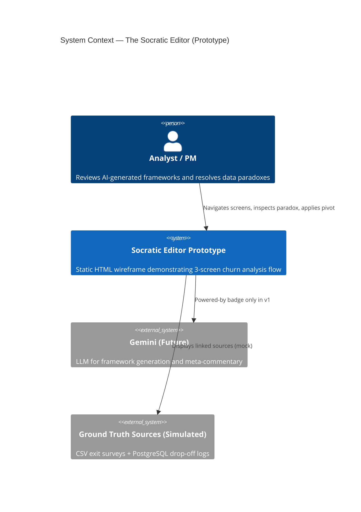
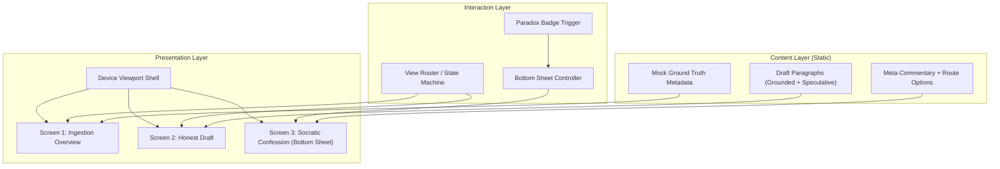
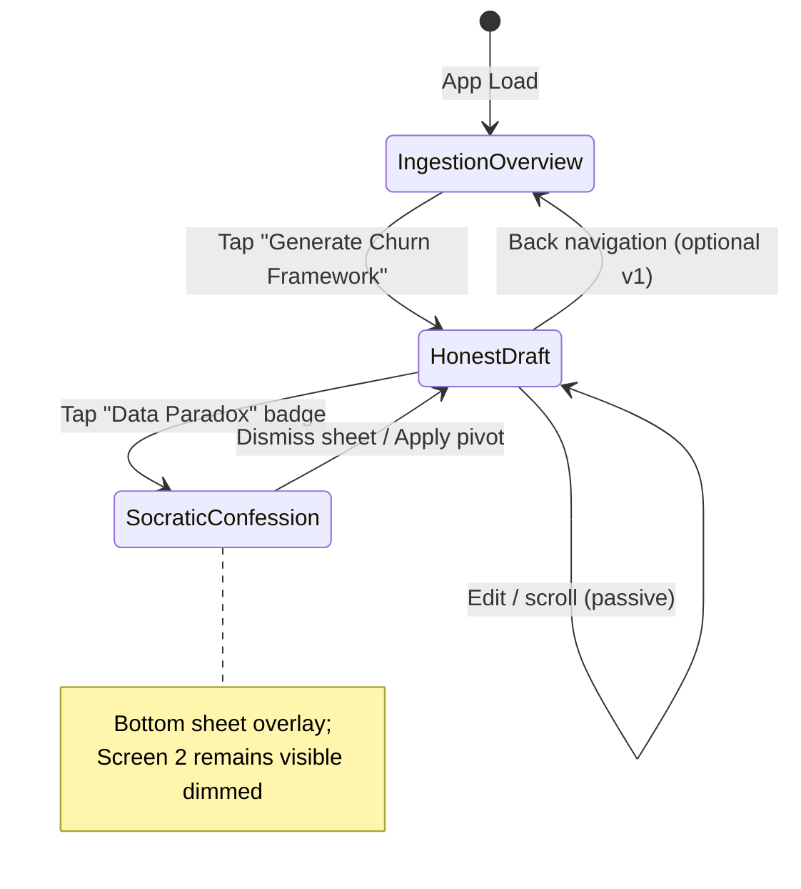
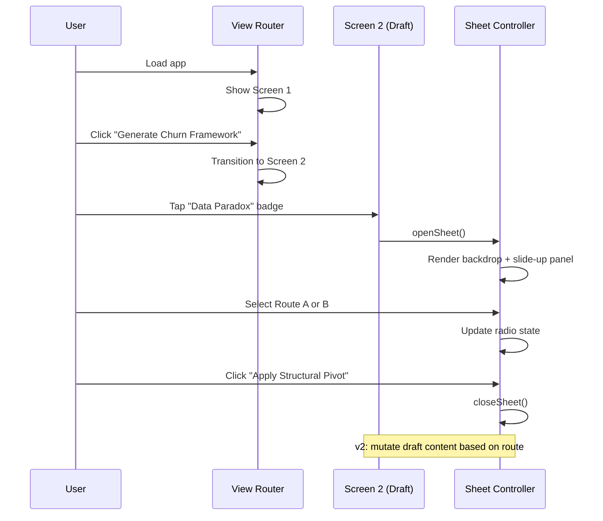

# The Socratic Editor — Architecture Document

**Version:** 1.0  
**Date:** May 30, 2026  
**Scope:** Mobile wireframe prototype (HTML + Tailwind CSS)  
**Scenario:** Churn Analysis — 3-step interactive screen flow

---

## 1. Executive Summary

The Socratic Editor is a mobile-first AI productivity prototype that surfaces **grounded vs. speculative** reasoning in analytical workflows. Unlike conventional AI editors that present a single confident narrative, this app makes internal model disagreement visible and actionable—forcing a human-in-the-loop decision before structural changes are applied.

This document defines the architecture for a **static, presentation-ready wireframe** constrained to iPhone viewport dimensions. There is no backend, authentication, or live Gemini integration in v1; the prototype simulates the UX contract that a production system would eventually fulfill.

### Design Principles

| Principle | Description |
|-----------|-------------|
| **Grounded first** | Data-linked context is shown before any generated output. |
| **Speculative transparency** | AI leaps beyond evidence are visually flagged, never hidden. |
| **Socratic confession** | The system admits disagreement and offers explicit routing choices. |
| **Human override** | The user selects the structural pivot; the AI does not auto-apply. |
| **Wireframe fidelity** | Grayscale palette with amber reserved exclusively for data paradox states. |

---

## 2. System Context



### In Scope (v1 Prototype)

- Centered iPhone device shell (375×812 logical px baseline)
- Three logical screens with client-side navigation
- Bottom sheet overlay for Socratic confession
- Static copy matching the Churn Analysis scenario
- Grayscale + amber design system via Tailwind

### Out of Scope (v1)

- Real API calls to Gemini or database connectors
- File upload / ingestion pipelines
- Persistence (localStorage, backend sync)
- Authentication and multi-project support
- Analytics, A/B testing, or trust-score visualizations

---

## 3. High-Level Architecture

The prototype follows a **single-page application (SPA-lite)** pattern: one HTML document, one CSS bundle (Tailwind), and a thin JavaScript layer for view routing and bottom-sheet interaction.



### Architectural Style

| Aspect | Decision | Rationale |
|--------|----------|-----------|
| Deployment | Static files (HTML/CSS/JS) | Zero infrastructure; easy to demo |
| Rendering | Client-side DOM show/hide | No build step required for v1 |
| Styling | Tailwind CDN or compiled utility classes | Matches spec; rapid iteration |
| State | In-memory JS object | Sufficient for 3-screen demo flow |
| Navigation | Finite state machine (3 states + overlay) | Predictable, testable transitions |

---

## 4. Screen Flow Architecture



### Screen Responsibilities

| Screen | ID | Primary Job | Entry | Exit |
|--------|-----|-------------|-------|------|
| Ingestion Overview | `screen-ingestion` | Establish trust via linked ground truth | App load | CTA → Screen 2 |
| Honest Draft | `screen-draft` | Show grounded + speculative content side-by-side | Screen 1 CTA | Paradox badge → Sheet |
| Socratic Confession | `sheet-confession` | Expose disagreement; collect human route choice | Paradox tap | Apply / dismiss |

---

## 5. Component Architecture

### 5.1 Device Shell

The outermost container simulates a physical iPhone frame centered on a neutral canvas.

```
┌─────────────────────────────────────┐
│  Page Canvas (bg-neutral-100)      │
│    ┌─────────────────────────┐      │
│    │  Device Shell           │      │
│    │  max-w-[375px]          │      │
│    │  h-[812px]              │      │
│    │  rounded-[2.5rem]       │      │
│    │  shadow-xl              │      │
│    │  overflow-hidden        │      │
│    │  ┌───────────────────┐  │      │
│    │  │  App Viewport     │  │      │
│    │  │  (screens live    │  │      │
│    │  │   here)           │  │      │
│    │  └───────────────────┘  │      │
│    └─────────────────────────┘      │
└─────────────────────────────────────┘
```

**Properties:**
- Fixed aspect ratio; no responsive breakpoints beyond centering
- `overflow-hidden` on shell; internal screens scroll independently
- Safe-area padding for notch simulation (optional cosmetic)

### 5.2 Screen 1 — Ingestion Overview

| Component | Tailwind Intent | Behavior |
|-----------|-----------------|----------|
| `Header` | `px-4 pt-12 pb-4` | Title + Gemini sub-label |
| `GroundTruthCard` | `mx-4 p-4 rounded-xl border border-neutral-200 bg-white` | Lists linked files |
| `FileRow` | `flex items-center gap-3` | Icon + filename |
| `ContextBadge` | `bg-emerald-50 text-emerald-700` (green check variant) | "Context Fully Grounded" |
| `PrimaryCTA` | `fixed bottom-0 inset-x-0 p-4` | Full-width button |

**Content model:**

```json
{
  "projectTitle": "Project: Churn Analysis",
  "poweredBy": "Powered by Gemini",
  "groundTruth": [
    { "type": "file", "name": "100_Exit_Surveys.csv", "icon": "document" },
    { "type": "database", "name": "postgres_dropoff_logs.sql", "icon": "database" }
  ],
  "contextStatus": {
    "label": "Context Fully Grounded (2M Window Active)",
    "grounded": true
  }
}
```

### 5.3 Screen 2 — The Honest Draft

| Component | Purpose |
|-----------|---------|
| `DraftHeader` | Back arrow + "Churn Framework Draft" title |
| `GroundedParagraph` | Standard gray body text (paragraph 1) |
| `ParadoxBadge` | Amber pill: "⚠️ Data Paradox Tap to inspect" — **only amber element besides speculative box** |
| `SpeculativeBlock` | Amber dashed border container (paragraph 2) |
| `ProgressNav` | Minimal bottom progress indicator for document editing |

**Visual hierarchy:**

```
┌──────────────────────────────┐
│ ← Churn Framework Draft      │
├──────────────────────────────┤
│ [Grounded paragraph — gray]  │
│                              │
│ ┌─ ⚠️ Data Paradox badge ─┐  │
│ │ ┌ - - - - - - - - - - ┐ │  │
│ │ │ Speculative text    │ │  │  ← amber dashed border ONLY
│ │ └ - - - - - - - - - - ┘ │  │
│ └──────────────────────────┘  │
├──────────────────────────────┤
│ ● ○ ○  Progress tracker     │
└──────────────────────────────┘
```

### 5.4 Screen 3 — Socratic Confession (Bottom Sheet)

Rendered as an **overlay layer** atop Screen 2, not a separate full-screen route.

| Component | Purpose |
|-----------|---------|
| `Backdrop` | Semi-transparent dim (`bg-black/40`) over Screen 2 |
| `SheetPanel` | Slides up to ~50% viewport height |
| `DragHandle` | Centered pill bar (`w-10 h-1 rounded-full bg-neutral-300`) |
| `SheetTitle` | "🤔 Internal Disagreement (Speculative Logic)" |
| `MetaCommentary` | Explains conflicting signals (PostgreSQL vs exit surveys) |
| `RouteRadioGroup` | Vertical radio options (Route A / Route B) |
| `ApplyButton` | "Apply Structural Pivot" — full width |

**Default selection:** Route B (Recommended Shift) pre-selected to demonstrate the intended corrective behavior.

---

## 6. Interaction Architecture

### 6.1 Event Flow



### 6.2 Bottom Sheet Controller

**States:**

| State | DOM Effect |
|-------|------------|
| `closed` | Sheet hidden; no backdrop; Screen 2 fully interactive |
| `opening` | Backdrop fades in; sheet translates Y from 100% → 0 |
| `open` | Sheet at 50% height; backdrop blocks Screen 2 interaction |
| `closing` | Reverse animation; return to `closed` |

**Gestures (optional v1.1):**
- Tap backdrop → close
- Drag handle downward → close
- Escape key → close (desktop demo convenience)

### 6.3 View Router

Minimal finite state machine:

```javascript
const AppState = {
  currentScreen: 'ingestion',  // 'ingestion' | 'draft'
  sheetOpen: false,
  selectedRoute: 'route-b'     // 'route-a' | 'route-b'
};
```

Transitions are synchronous DOM class toggles (`hidden` / `block` or `opacity-0` / `opacity-100`).

---

## 7. Design System Architecture

### 7.1 Color Tokens

Amber/yellow is **exclusively** reserved for data paradox signaling. All other UI uses grayscale.

| Token | Tailwind Class | Usage |
|-------|----------------|-------|
| `canvas` | `bg-neutral-100` | Page background outside device |
| `surface` | `bg-white` | Cards, sheet panel |
| `surface-muted` | `bg-neutral-50` | Secondary panels |
| `text-primary` | `text-neutral-900` | Headings, body |
| `text-secondary` | `text-neutral-500` | Sub-labels, meta |
| `text-tertiary` | `text-neutral-400` | Placeholders, disabled |
| `border-default` | `border-neutral-200` | Card borders |
| `border-strong` | `border-neutral-300` | Dividers |
| **`paradox-amber`** | `text-amber-600 bg-amber-50 border-amber-300` | Badge + speculative block **only** |
| `cta-primary` | `bg-neutral-900 text-white` | Primary actions |
| `cta-secondary` | `bg-neutral-200 text-neutral-900` | Secondary actions |
| `success-grounded` | `text-emerald-700 bg-emerald-50` | Grounding checkmark badge |

**Constraint:** No amber on buttons, headers, progress indicators, or decorative elements.

### 7.2 Typography Scale

| Role | Size | Weight | Color |
|------|------|--------|-------|
| Screen title | `text-lg` | `font-semibold` | `neutral-900` |
| Sub-label | `text-xs` | `font-normal` | `neutral-500` |
| Body (grounded) | `text-sm` | `font-normal` | `neutral-700` |
| Body (speculative) | `text-sm` | `font-normal` | `neutral-700` |
| Badge | `text-xs` | `font-medium` | `amber-600` |
| Sheet title | `text-base` | `font-bold` | `neutral-800` |

### 7.3 Spacing & Radius

- Base unit: Tailwind 4px scale (`p-4`, `gap-3`, `space-y-4`)
- Card radius: `rounded-xl` (12px)
- Device shell radius: `rounded-[2.5rem]`
- Badge radius: `rounded-full`
- Speculative block: `rounded-lg border-2 border-dashed`

### 7.4 Iconography

Use inline SVG or Heroicons (outline, neutral-500):
- Document icon → CSV file
- Database cylinder → SQL source
- Chevron/back arrow → navigation
- Check circle → grounding status

No chart widgets, percentage trust rings, or gamified badges per spec.

---

## 8. Data Architecture

v1 uses **embedded static content**. No fetch layer.

### 8.1 Content Schema

```typescript
interface GroundTruthItem {
  type: 'file' | 'database';
  name: string;
  icon: 'document' | 'database';
}

interface DraftContent {
  groundedParagraph: string;
  speculativeParagraph: string;
  paradoxBadgeLabel: string;
}

interface ConfessionContent {
  title: string;
  metaCommentary: string;
  routes: {
    id: 'route-a' | 'route-b';
    label: string;
    description?: string;
    recommended?: boolean;
  }[];
  applyButtonLabel: string;
}

interface ChurnScenario {
  project: { title: string; poweredBy: string };
  groundTruth: GroundTruthItem[];
  contextStatus: { label: string; grounded: boolean };
  draft: DraftContent;
  confession: ConfessionContent;
}
```

### 8.2 Scenario Payload (Churn Analysis)

All copy from the problem statement maps 1:1 into `content/churn-scenario.json` or a `<script type="application/json">` block for zero-build loading.

### 8.3 Future Data Pipeline (Production Path)

```mermaid
flowchart LR
    Sources["Ground Truth Sources"] --> Ingestion["Ingestion Service"]
    Ingestion --> ContextWindow["2M Token Context Window"]
    ContextWindow --> Gemini["Gemini API"]
    Gemini --> DraftGen["Draft Generator"]
    DraftGen --> ParadoxDetector["Paradox Detector"]
    ParadoxDetector --> UI["Socratic Editor UI"]
    UI --> UserChoice["Human Route Selection"]
    UserChoice --> PivotEngine["Structural Pivot Engine"]
```



---

## 9. File & Directory Structure

```
prototype/
├── docs/
│   └── architecture.md          ← this document
├── src/
│   ├── index.html               ← entry point + device shell
│   ├── css/
│   │   └── input.css            ← Tailwind directives (if compiled)
│   ├── js/
│   │   ├── app.js               ← bootstrap, state init
│   │   ├── router.js            ← screen transitions
│   │   └── sheet.js             ← bottom sheet controller
│   ├── components/              ← optional: HTML partials via JS template strings
│   │   ├── screen-ingestion.js
│   │   ├── screen-draft.js
│   │   └── sheet-confession.js
│   └── content/
│       └── churn-scenario.json  ← static scenario data
├── Problemstatememnt            ← original brief
├── package.json                 ← optional: Tailwind build scripts
└── tailwind.config.js           ← optional: content paths + amber safelist
```

### Build Options

| Mode | Setup | Best For |
|------|-------|----------|
| **Zero-build** | Tailwind CDN in `index.html` | Fastest demo |
| **Compiled** | `npm run build:css` | Production-like asset pipeline |

---

## 10. Accessibility Architecture

| Requirement | Implementation |
|-------------|----------------|
| Focus management | Trap focus in open bottom sheet; restore on close |
| Keyboard | Tab through radio group; Enter to apply |
| ARIA | `role="dialog"` on sheet; `aria-modal="true"`; labelledby sheet title |
| Color | Amber badge includes ⚠️ emoji + text (not color-only) |
| Touch targets | Minimum 44×44px for badge, buttons, radio rows |
| Motion | Respect `prefers-reduced-motion`; skip slide animation |

---

## 11. Animation Specifications

| Element | Property | Duration | Easing |
|---------|----------|----------|--------|
| Screen transition | `opacity` crossfade | 200ms | `ease-out` |
| Backdrop | `opacity` 0 → 0.4 | 250ms | `ease-out` |
| Bottom sheet | `transform: translateY` | 300ms | `cubic-bezier(0.32, 0.72, 0, 1)` |
| Badge tap | `scale(0.97)` press | 100ms | `ease-in-out` |

---

## 12. Security & Privacy (Production Considerations)

Not applicable to static v1. Documented for future integration:

- Ground truth files may contain PII; ingestion must redact before LLM context
- PostgreSQL connection strings must never ship to client
- Gemini API keys remain server-side; prototype badge is cosmetic only
- User route selections may constitute audit logs for compliance

---

## 13. Testing Strategy

### 13.1 Manual Test Checklist

- [ ] Device shell centered at 375×812 on desktop viewport
- [ ] Screen 1 → Screen 2 navigation works
- [ ] Ground truth card displays both sources with icons
- [ ] Green grounding badge visible
- [ ] Screen 2 grounded text is plain gray (no amber)
- [ ] Paradox badge is amber; speculative block has dashed amber border
- [ ] Tapping badge opens bottom sheet at ~50% height
- [ ] Screen 2 visible and dimmed behind sheet
- [ ] Route B pre-selected; radio toggles work
- [ ] "Apply Structural Pivot" closes sheet
- [ ] No amber used outside paradox elements
- [ ] No trust charts or gimmicky badges present

### 13.2 Visual Regression (Optional)

Capture screenshots at each screen state for presentation consistency.

---

## 14. Evolution Roadmap

| Phase | Capability |
|-------|------------|
| **v1 (current)** | Static 3-screen wireframe, client-side navigation |
| **v1.1** | Route selection mutates draft paragraph content |
| **v2** | Live Gemini integration with streaming draft |
| **v2.1** | Real file/DB ingestion + grounding verification |
| **v3** | Multi-scenario support, project switcher, persistence |
| **v4** | Production pipeline: paradox detector, PII redaction, audit log, backend state sync, 2M context window |
| **v5** | Screen flow polish & component architecture: extracted components, focus trap, drag-dismiss sheet, labeled progress tracker, safe-area shell |
| **v6** | Interaction architecture (§6): central AppState, sheet phases (opening/open/closing/closed), Enter-to-apply keyboard, draft edit mode, audit history UI, sample source loader |
| **v7** | Design system (§7): CSS token layer, semantic `ds-*` classes, Tailwind theme extension, amber exclusivity audit, typography/spacing tokens |
| **v8** | Testing (§13): Node test suite, scenario JSON schema validation, `/api/self-test`, automated smoke checklist script |
| **v9** | Build & data pipeline (§8–9, §12): `dist/` production build, README/Docker, SQL grounding service, `POST /api/connect-database` (server-side only; optional `DATABASE_URL` + `pg`) |

---

## 15. Key Architectural Decisions (ADRs)

### ADR-001: Single HTML page over multi-page

**Decision:** One `index.html` with show/hide screens.  
**Rationale:** Eliminates page reload flicker; bottom sheet requires Screen 2 to remain mounted.  
**Trade-off:** Slightly larger initial DOM; acceptable for 3 screens.

### ADR-002: Bottom sheet as overlay, not route

**Decision:** Sheet is a layer, not `screen-3` in the router.  
**Rationale:** Spec requires Screen 2 visible (dimmed) behind the confession UI.  
**Trade-off:** Router state must track `sheetOpen` separately from `currentScreen`.

### ADR-003: Amber color exclusivity

**Decision:** Enforce amber-only-for-paradox via design tokens and code review.  
**Rationale:** Visual language must instantly communicate "speculative / contradictory" without noise.  
**Trade-off:** Primary CTAs use neutral-900 instead of blue (spec allows "blue or dark gray").

### ADR-004: No generic trust visualizations

**Decision:** Exclude percentage charts, confidence meters, and layout gimmicks.  
**Rationale:** Explicit problem statement constraint; grounding is shown via source linkage + badge.  
**Trade-off:** Less "AI product" aesthetic; more editorial/document feel.

---

## 16. Appendix: Screen Copy Reference

### Screen 1
- **Title:** Project: Churn Analysis
- **Sub-label:** Powered by Gemini
- **Sources:** `100_Exit_Surveys.csv`, `postgres_dropoff_logs.sql`
- **Badge:** Context Fully Grounded (2M Window Active)
- **CTA:** Generate Churn Framework →

### Screen 2
- **Title:** Churn Framework Draft
- **Speculative text:** "Based on user behavior, we see a heavy 8% drop-off at week two. To solve this, we should redesign the onboarding setup wizard to shorten time-to-value."
- **Badge:** ⚠️ Data Paradox Tap to inspect

### Screen 3 (Sheet)
- **Title:** 🤔 Internal Disagreement (Speculative Logic)
- **Meta-commentary:** PostgreSQL setup-screen drop-offs vs exit-survey pricing complaints
- **Route A:** Redesign UX Onboarding Flow (Current Baseline)
- **Route B:** Pivot to Pricing Model Evaluation (Recommended Shift)
- **Action:** Apply Structural Pivot

---

*End of architecture document.*
